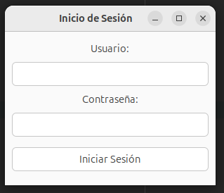
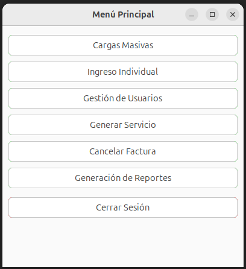
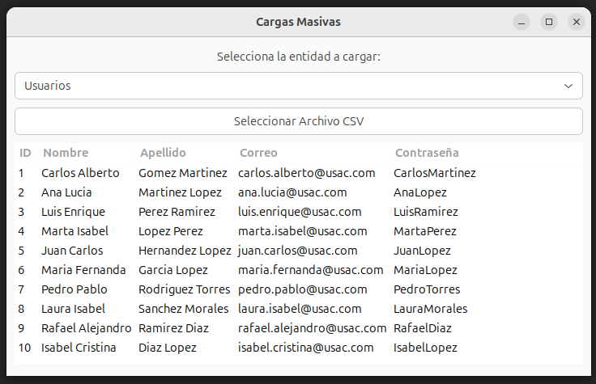
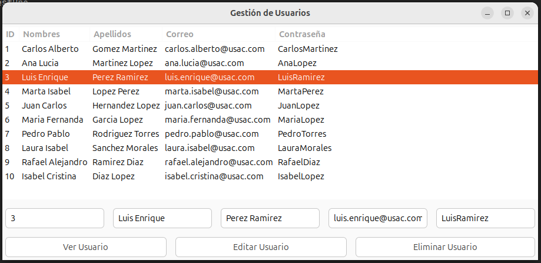
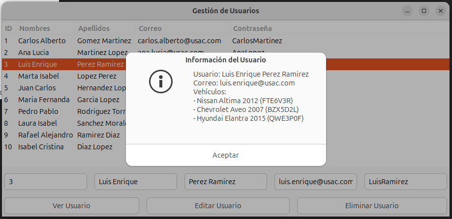
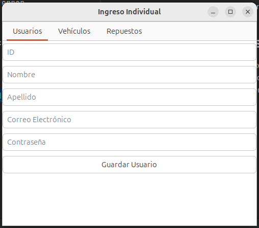
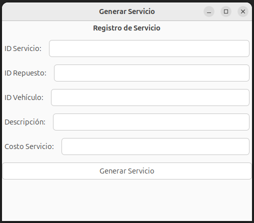
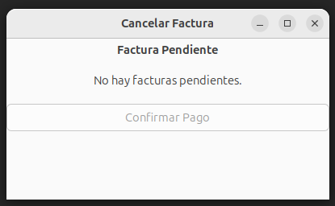
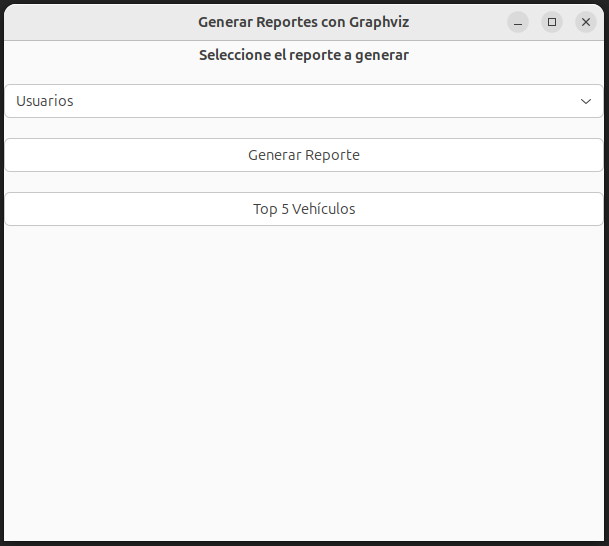
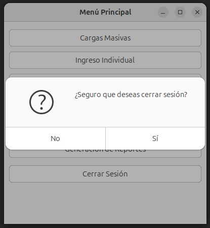

# 📖 Manual de Usuario

## 📌 Introducción
Este sistema permite la gestión de usuarios, vehículos, repuestos, servicios y facturación de manera eficiente. Incluye la generación de reportes en formato visual utilizando Graphviz.

## 💻 Requisitos del Sistema
- **Sistema Operativo:** Windows 10/11, Ubuntu 20.04+, MacOS
- **Dependencias:**
  - .NET 6+ instalado
  - GTK# para la interfaz gráfica
  - Graphviz para la generación de reportes

## 🚀 Instalación
1. Descarga e instala **.NET 6 SDK** desde [dotnet.microsoft.com](https://dotnet.microsoft.com/).
2. Instala **GTK#**:
   - **Linux:** `sudo apt-get install gtk-sharp2`
   - **Windows:** Descarga desde [gtk.org](https://www.gtk.org/)
3. Instala **Graphviz**:
   - **Linux:** `sudo apt-get install graphviz`
   - **Windows:** Descarga desde [graphviz.org](https://graphviz.org/)
4. Clona el repositorio y ejecuta el sistema con:
   ```sh
   git clone https://github.com/Santiago78op/EDD_1S2025_201905884.git
   cd tu-repositorio
   dotnet run
   ```
## 🖥️ Descripción de la Interfaz
Contiene accesos directos a las funcionalidades principales:
- **Carga Masiva**
- **Gestión de Usuarios**
- **Generar Servicio**
- **Cancelar Factura**
- **Generar Reportes**
- **Cerrar Sesión**

## 🔑 Inicio de Sesión
- Ingresar el usuario y contraseña.
- Presionar "Iniciar Sesión" para acceder al menú principal.
- En caso de error, se mostrará un mensaje de alerta.



## 📋 Menú Principal
- Menú desplegable con las opciones de gestión.
- Seleccionar una opción para acceder a la funcionalidad correspondiente.
- Al seleccionar una opción, se mostrará la pantalla correspondiente.
- En caso de error, se mostrará un mensaje de alerta.



## 📝 Carga Masiva
- Permite cargar usuarios, vehículos y repuestos desde un archivo Json.
- Seleccionar el archivo y presionar "Cargar".
- Se mostrará un mensaje de confirmación.
- Los datos cargados se visualizarán en la tabla correspondiente.



## 🛠️ Uso del Sistema

## 👥 Gestión de Usuarios

- **Ver Usuario:** Ingresar el ID del usuario y visualizar sus datos.
- **Editar Usuario:** Modificar Nombre, Apellido y Correo.
- **Eliminar Usuario:** Eliminar un usuario por su ID.



## 👥 Gestión de Clientes
- Agregar un nuevo cliente con su nombre, apellido y correo.
- Ingresar el ID del cliente para verificar su existencia.
- Si el cliente existe, mostrará un mensaje de error.

## 🚗 Gestión de Vehículos
- Agregar un nuevo vehículo con su marca, modelo y año.
- Ingresar el ID del vehículo para verificar su existencia.
- Si el vehículo existe, mostrará un mensaje de error.

## 🛠️ Gestión de Repuestos
- Agregar un nuevo repuesto con su nombre y precio.
- Ingresar el ID del repuesto para verificar su existencia.
- Si el repuesto existe, mostrará un mensaje de error.

### **Gestion de Ingreso Individual**



## 🛠️ Generar Servicio
- **Ingresar ID de Usuario y Vehículo**
- **Seleccionar Tipo de Servicio**
- **Asignar Repuesto (Opcional)**
- **Confirmar y Registrar**



### 🧾 **Cancelar Factura**
- Se mostrará la última factura generada.
- Confirmar el pago y retirar de la pila.



## 📊 Generar Reportes
- Seleccionar el tipo de reporte:
  - **Usuarios y Vehículos**
  - **Repuestos y Servicios**
  - **Facturación**
- Exportar en PNG.



## 🔒 Cerrar Sesión
- Al presionar el botón de "Cerrar Sesión", se redirige a la pantalla de login.

