# 📖 Manual de Usuario

## 📌 Introducción
Este sistema permite la gestión de usuarios, vehículos, repuestos, servicios y facturación de manera eficiente. Incluye la generación de reportes en formato visual utilizando Graphviz.

## 💻 Requisitos del Sistema
- **Sistema Operativo:** Windows 10/11, Ubuntu 20.04+, MacOS
- **Dependencias:**
  - .NET 6+ instalado
  - GTK# para la interfaz gráfica
  - Graphviz para la generación de reportes

## 🚀 Instalación
1. Descarga e instala **.NET 6 SDK** desde [dotnet.microsoft.com](https://dotnet.microsoft.com/).
2. Instala **GTK#**:
  - **Linux:** `sudo apt-get install gtk-sharp2`
  - **Windows:** Descarga desde [gtk.org](https://www.gtk.org/)
3. Instala **Graphviz**:
  - **Linux:** `sudo apt-get install graphviz`
  - **Windows:** Descarga desde [graphviz.org](https://graphviz.org/)
4. Clona el repositorio y ejecuta el sistema con:
   ```sh
   git clone https://github.com/Santiago78op/EDD_1S2025_201905884.git
   cd tu-repositorio
   dotnet run
   ```
## 🖥️ Descripción de la Interfaz
Contiene accesos directos a las funcionalidades principales:
- **Carga Masiva**
- **Gestión de Entidades**
- **Actuaslización de Repuestos**
- **Visualización de Repuestos**
- **Control de Logueo**
- **Generar Servicio**
- **Generar Reportes**
- **Cerrar Sesión**

## 🔑 Inicio de Sesión
- Ingresar el usuario y contraseña.
- Presionar "Iniciar Sesión" para acceder al menú principal.
- En caso de error, se mostrará un mensaje de alerta.

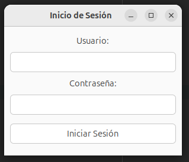

## 📋 Menú Principal
- Menú desplegable con las opciones de gestión.
- Seleccionar una opción para acceder a la funcionalidad correspondiente.
- Al seleccionar una opción, se mostrará la pantalla correspondiente.
- En caso de error, se mostrará un mensaje de alerta.

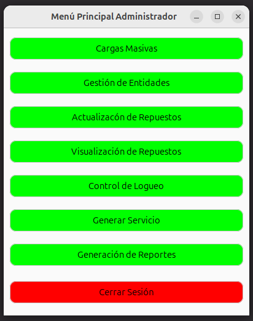

## 📝 Carga Masiva
- Permite cargar usuarios, vehículos y repuestos desde un archivo Json.
- Seleccionar el archivo y presionar "Cargar".
- Se mostrará un mensaje de confirmación.
- Los datos cargados se visualizarán en la tabla correspondiente.

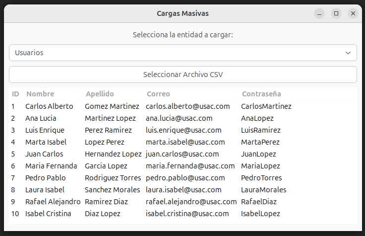

## 🛠️ Uso del Sistema

## 👥 Gestión de Usuarios y Vehículos
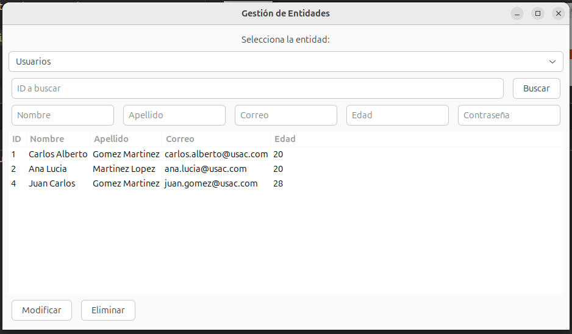
- **Visualizar Usuarios:** Se muestra la lista de usuarios registrados en el sistema.
- **Editar Usuarios:** Modifique los datos personales de un usuario.
- **Eliminar Usuarios:** Elimina un usuario junto con sus vehículos asociados.
- **Buscar Usuario:** Encuentre usuarios por ID.


## 🛠️ Gestión de Repuestos
- Se visualizan los repuestos disponibles en el taller.
- Se pueden buscar repuestos por ID.
- Se pueden modificar los datos de un repuesto.

### **Gestion de Ingreso Individual**

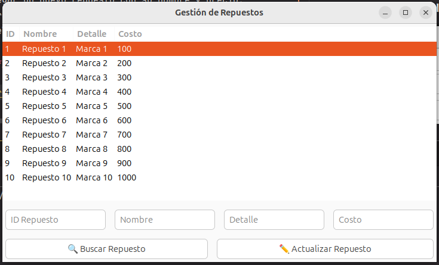

## 🛠️ Visualización de Repuestos 
- Se visualizan los repuestos disponibles en el taller.
- Se pueden visualizar en tres tipos de Orden:
  - **Pre-Orden**
  - **In-Orden**
  - **Post-Orden**

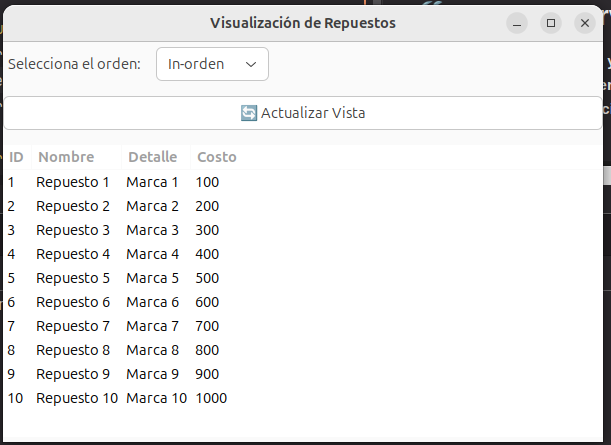

## 🛗 Control de Logueo
- Se visualiza el log de actividad de los usuarios.
- Se puede exportar el log en formato JSON.

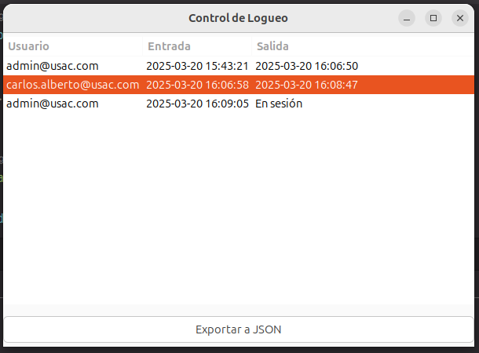


## 🛠️ Generar Servicio
- **Ingresar ID de Usuario y Vehículo**
- **Seleccionar Tipo de Servicio**
- **Asignar Repuesto (Opcional)**
- **Confirmar y Registrar**

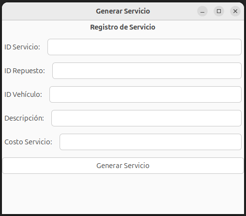

## 📊 Generar Reportes
- Seleccionar el tipo de reporte:
  - **Usuarios y Vehículos**
  - **Repuestos y Servicios**
  - **Facturación**
- Exportar en PNG.

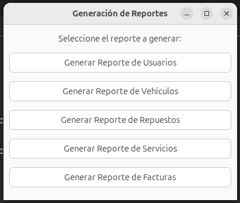

## 🔒 Cerrar Sesión
- Al presionar el botón de "Cerrar Sesión", se redirige a la pantalla de login.

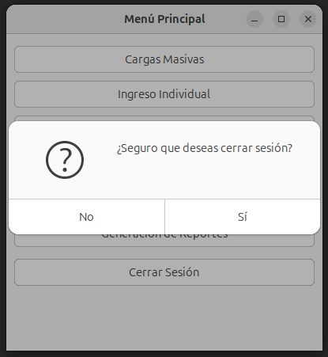

## 2. Acceso al Sistema
1. Ingrese su **correo** y **contraseña** en la pantalla de inicio de sesión.
2. Si el usuario es **administrador**, tendrá acceso a todas las funcionalidades.
3. Si el usuario es **normal**, solo podrá gestionar sus vehículos, servicios y facturas.

## 3. Funcionalidades

### 3.1 Gestión de Usuarios y Vehículos (Administrador)
- **Visualizar Usuarios:** Se muestra la lista de usuarios registrados en el sistema.
- **Editar Usuarios:** Modifique los datos personales de un usuario.
- **Eliminar Usuarios:** Elimina un usuario junto con sus vehículos asociados.
- **Buscar Usuario:** Encuentre usuarios por ID.

### 3.2 Gestión de Servicios
- **Generar Servicio:** Asigna un servicio a un usuario y su vehículo.
- **Asociar Repuestos:** Se seleccionan repuestos para el servicio.
- **Generar Factura:** Automáticamente se genera una factura por el servicio prestado.
- **Visualizar Servicios:** Se pueden filtrar servicios por **PRE-ORDEN, POST-ORDEN e IN-ORDEN**.

### 3.3 Facturación
- **Ver Facturas:** Lista de facturas pendientes de pago.
- **Cancelar Factura:** Se elimina una factura cuando el usuario la paga.

### 3.4 Reportes
- **Visualización Gráfica:**
    - **Árbol AVL**: Repuestos disponibles en el taller.
    - **Árbol Binario**: Servicios realizados.
    - **Árbol B**: Facturación del sistema.
    - **Matriz Dispersa**: Relación entre vehículos y repuestos.

### 3.5 Log de Actividad
- **Exportación en JSON:** El administrador puede exportar un log con las entradas y salidas de los usuarios.

## 4. Soporte y Contacto
Si encuentra algún error o problema, comuníquese con el soporte técnico a: **soporte@autogestpro.com**.

## 🖥️ Descripción de la Interfaz de Usuario
- **Menú Principal:** Acceso a las funcionalidades principales.
  -**Insertar Vehículo:** Agregar un vehículo al sistema.
  -**Visualización de Servicios:** Ver los servicios realizados.
  -**Visualización de Facturas:** Ver las facturas pendientes.
  -**Cancelar Factura:** Eliminar una factura.
  -**Cerrar Sesión:** Salir del sistema.

## 📋 Menú Principal
- Menú desplegable con las opciones de gestión.
- Seleccionar una opción para acceder a la funcionalidad correspondiente.
- Al seleccionar una opción, se mostrará la pantalla correspondiente.
- En caso de error, se mostrará un mensaje de alerta.

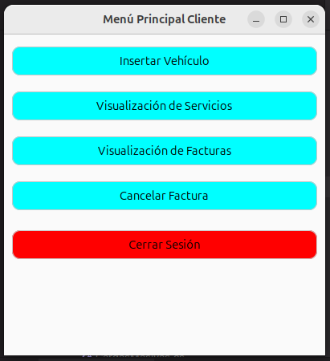

## 🚘 Ingreso de Vehículo
- **Ingresar Marca, Modelo y Año**

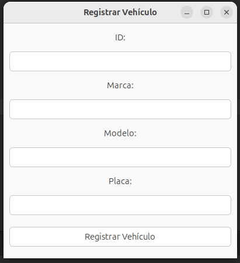

## 📝 Visualización de Servicios
- **Visualizar Servicios:** Se pueden filtrar servicios por 
- **PRE-ORDEN, POST-ORDEN e IN-ORDEN**

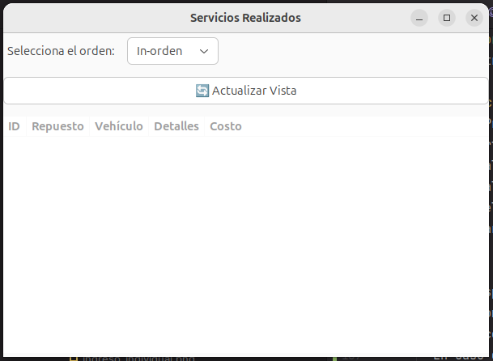

## 📊 Visualización de Facturas
- **Ver Facturas:** Lista de facturas pendientes de pago.

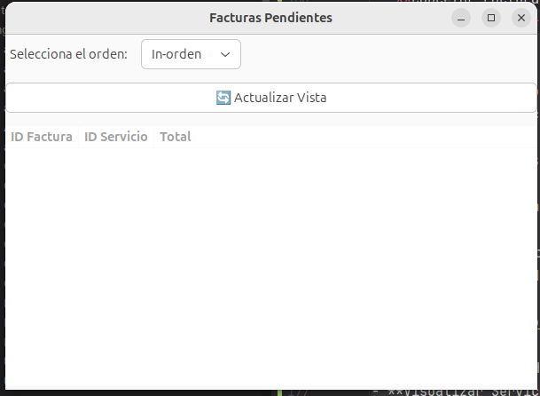

## 📝 Cancelar Factura
- **Cancelar Factura:** Se elimina una factura cuando el usuario la paga.

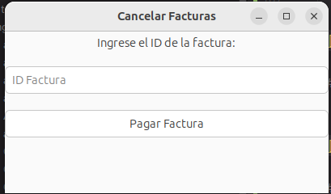

