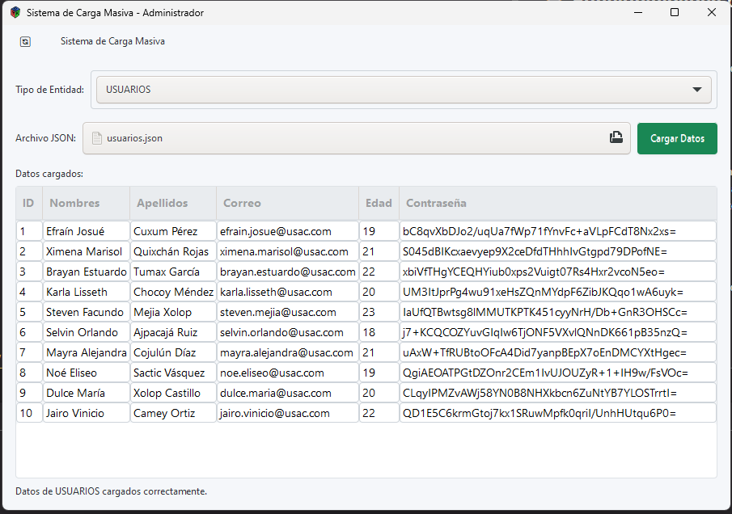

# 📖 Manual de Usuario - AutoGest Pro - Fase 3

## 📌 Introducción

AutoGest Pro es un sistema integral de gestión diseñado específicamente para talleres de reparación de vehículos. Este software optimiza las operaciones diarias, desde el registro seguro de usuarios hasta la gestión de vehículos, repuestos, servicios y facturas, asegurando eficiencia y organización.

En esta fase, se incorporan estructuras avanzadas como grafo no dirigido, compresión Huffman, Blockchain y Árbol de Merkle, mejorando la seguridad, el análisis relacional y el almacenamiento de datos. La interfaz gráfica, desarrollada con GTK, ofrece un entorno intuitivo y adaptable.

## 💻 Requisitos del Sistema

- **Sistema Operativo:** Linux (distribución libre)
- **Dependencias:**
    - .NET 6+ instalado
    - GTK# para la interfaz gráfica
    - Graphviz para la generación de reportes

## 🚀 Instalación

1. Descarga e instala **.NET 6 SDK** desde [dotnet.microsoft.com](https://dotnet.microsoft.com/).
2. Instala **GTK#**:
    - **Linux:** `sudo apt-get install gtk-sharp2`
3. Instala **Graphviz**:
    - **Linux:** `sudo apt-get install graphviz`
4. Clona el repositorio y ejecuta el sistema con:
   ```sh
   git clone https://github.com/[username]/[EDD]1S2025_[carnet].git
   cd [EDD]1S2025_[carnet]/Fase3
   dotnet run
   ```

## 🔑 Inicio de Sesión

La pantalla de inicio de sesión permite acceder al sistema con credenciales de usuario:

- **Usuario Administrador:** admin@usac.com
- **Contraseña Administrador:** admin123

Para usuarios regulares, deberán utilizar las credenciales proporcionadas durante el registro.


### Proceso de Inicio de Sesión:

1. Ingresa tu **correo electrónico** en el campo "Correo".
2. Ingresa tu **contraseña** en el campo "Contraseña".
3. Haz clic en el botón "Validar".
4. Si las credenciales son correctas, accederás al menú principal según tu rol (administrador o usuario).
5. Si las credenciales son incorrectas, se mostrará un mensaje de error.

## 🖥️ Menú Principal - Rol Administrador

Después de iniciar sesión como administrador, se mostrará el menú principal con las siguientes opciones:


### Principales Funcionalidades:

1. **Carga Masiva:** Permite importar datos de usuarios, vehículos, repuestos y servicios desde archivos JSON.
2. **Gestión de Usuarios:** Administra los registros de usuarios.
3. **Actualización de Repuestos:** Modifica la información de repuestos existentes.
4. **Visualización de Repuestos:** Consulta el inventario de repuestos en diferentes órdenes.
5. **Control de Logueo:** Supervisa la actividad de ingreso y salida de usuarios.
6. **Generar Servicio:** Crea nuevos servicios asociando vehículos y repuestos.
7. **Generación de Reportes:** Visualiza las estructuras de datos del sistema.
8. **Generar Backup:** Crea copias de seguridad de los datos.
9. **Cargar Backup:** Restaura los datos desde copias de seguridad.
10. **Cerrar Sesión:** Finaliza la sesión actual.

## 📋 Funcionalidades del Administrador

### 1. Carga Masiva

Esta opción permite importar datos desde archivos JSON para las entidades "USUARIOS", "VEHICULOS", "REPUESTOS", "SERVICIOS".



#### Proceso de Carga Masiva:

1. Selecciona la entidad a cargar del menú desplegable.
2. Haz clic en "Cargar" y selecciona el archivo JSON correspondiente.
3. El sistema validará y cargará los datos, mostrando un mensaje de confirmación.
4. En caso de errores (IDs duplicados, referencias inexistentes), se mostrarán mensajes de advertencia.

### 2. Inserción de Usuarios

Esta funcionalidad permite agregar nuevos usuarios al sistema, almacenándolos en la estructura Blockchain.


#### Proceso de Inserción de Usuario:

1. Completa los campos requeridos: ID, Nombres, Apellidos, Correo, Edad y Contraseña.
2. Haz clic en "Insertar".
3. El sistema verificará que el ID y correo sean únicos.
4. La contraseña se encriptará automáticamente con SHA-256.
5. Se mostrará un mensaje de confirmación tras la inserción exitosa.

### 3. Visualización de Usuarios

Permite consultar la información de usuarios registrados en el sistema.


#### Proceso de Visualización de Usuario:

1. Ingresa el ID del usuario a buscar.
2. Haz clic en "Buscar".
3. Se mostrarán los datos del usuario encontrado.

### 4. Actualización de Repuestos

Permite modificar la información de repuestos existentes en el sistema.

### 5. Visualización de Repuestos

Permite consultar el inventario de repuestos en tres diferentes órdenes: PRE-ORDEN, IN-ORDEN, POST-ORDEN.


#### Proceso de Visualización de Repuestos:

1. Selecciona el tipo de recorrido del menú desplegable (PRE-ORDEN, IN-ORDEN, POST-ORDEN).
2. La tabla mostrará los repuestos ordenados según la selección.

### 6. Control de Logueo

Esta funcionalidad registra y muestra la actividad de ingreso y salida de los usuarios en el sistema.


#### Proceso de Control de Logueo:

1. La tabla muestra el registro de actividad: usuario, fecha/hora de entrada y fecha/hora de salida.
2. Haz clic en "Exportar JSON" para guardar el registro en formato JSON.

### 7. Generar Servicio

Esta funcionalidad es esencial, ya que integra múltiples operaciones: creación de servicio, factura y relación en el grafo no dirigido.


#### Proceso de Generación de Servicio:

1. Completa los campos requeridos: ID, ID_Repuesto, ID_Vehículo, Detalles y Costo.
2. Haz clic en "Guardar".
3. El sistema verificará que los IDs de repuesto y vehículo existan en el sistema.
4. Automáticamente se creará una factura asociada al servicio.
5. Se establecerá una relación en el grafo no dirigido entre el vehículo y el repuesto utilizado.
6. Se mostrará un mensaje de confirmación tras la creación exitosa.

### 8. Generación de Reportes

Permite visualizar gráficamente las estructuras de datos implementadas en el sistema.


#### Tipos de Reportes Disponibles:

1. **Usuarios:** Visualiza la estructura Blockchain con los usuarios registrados.
2. **Vehículos:** Muestra la lista doblemente enlazada de vehículos.
3. **Repuestos:** Presenta el árbol AVL de repuestos.
4. **Servicios:** Muestra el árbol binario de servicios.
5. **Facturación:** Visualiza el árbol de Merkle de facturas.
6. **Grafo no dirigido:** Muestra las relaciones entre vehículos y repuestos.

#### Proceso de Generación de Reportes:

1. Selecciona el tipo de reporte del menú desplegable.
2. Haz clic en "Generar Reporte".
3. El sistema generará una imagen del reporte seleccionado.
4. La imagen se guardará en la carpeta "Reportes" del sistema.
5. Se abrirá automáticamente el visualizador de imágenes para mostrar el reporte.

### 9. Generar Backup

Esta funcionalidad permite crear copias de seguridad de las entidades del sistema.


#### Proceso de Generación de Backup:

1. Haz clic en la opción "Generar Backup" del menú principal.
2. El sistema generará:
    - Un archivo JSON con la entidad Usuarios (almacenada en Blockchain), sin aplicar compresión.
    - Archivos comprimidos (.edd) mediante el algoritmo Huffman para Vehículos y Repuestos.
3. Se mostrará un mensaje de confirmación tras la generación exitosa.

### 10. Cargar Backup

Esta funcionalidad se ejecuta al iniciar el programa y permite restaurar las entidades del sistema desde los archivos de backup.


#### Proceso de Carga de Backup:

1. Haz clic en la opción "Cargar Backup" del menú principal.
2. El sistema realizará las siguientes acciones:
    - Carga del archivo JSON de Usuarios en la estructura Blockchain, validando la integridad de la cadena.
    - Descompresión de los archivos .edd de Vehículos y Repuestos.
    - Validación de consistencia de los datos cargados.
3. Si se detecta corrupción en el Blockchain o discrepancias en los datos, se mostrará un mensaje de error.
4. Se mostrará un mensaje de confirmación tras la carga exitosa.

### 11. Cerrar Sesión

Para salir del sistema de forma segura:

1. Haz clic en la opción "Cerrar Sesión" del menú principal.
2. Se registrará la fecha y hora de salida en el log de actividad.
3. Se redirigirá a la pantalla de inicio de sesión.

## 🖥️ Menú Principal - Rol Usuario

Después de iniciar sesión como usuario regular, se mostrará el menú principal con opciones específicas para clientes:


### Principales Funcionalidades:

1. **Visualización de Vehículos:** Consulta los vehículos registrados a tu nombre.
2. **Visualización de Servicios:** Revisa los servicios realizados a tus vehículos.
3. **Visualización de Facturas:** Verifica las facturas pendientes de pago.
4. **Cerrar Sesión:** Finaliza la sesión actual.

## 📋 Funcionalidades del Usuario

### 1. Visualización de Vehículos

Esta funcionalidad permite al usuario ver los vehículos registrados a su nombre.


#### Proceso de Visualización de Vehículos:

1. Haz clic en "Visualizar Vehículo" en el menú principal.
2. La tabla mostrará todos los vehículos asociados a tu cuenta, incluyendo: ID, ID_Usuario, Marca, Modelo y Placa.

### 2. Visualización de Servicios

Permite consultar los servicios realizados a los vehículos del usuario, con diferentes opciones de visualización.


#### Proceso de Visualización de Servicios:

1. Haz clic en "Visualización de Servicios" en el menú principal.
2. Selecciona el tipo de recorrido del menú desplegable (PRE-ORDEN, IN-ORDEN, POST-ORDEN).
3. La tabla mostrará los servicios ordenados según la selección, incluyendo: ID, Repuesto, Vehículo, Detalles y Costo.

### 3. Visualización de Facturas

Permite al usuario ver las facturas pendientes de pago por los servicios realizados.


#### Proceso de Visualización de Facturas:

1. Haz clic en "Visualización de Facturas" en el menú principal.
2. La tabla mostrará todas las facturas pendientes, incluyendo: ID, Orden (ID_Servicio) y Total.

### 4. Cerrar Sesión

Para salir del sistema de forma segura:

1. Haz clic en la opción "Cerrar Sesión" del menú principal.
2. Se registrará la fecha y hora de salida en el log de actividad.
3. Se redirigirá a la pantalla de inicio de sesión.

## 🛠️ Estructuras de Datos Implementadas

AutoGest Pro utiliza estructuras de datos avanzadas para optimizar su funcionamiento:

### 1. Blockchain (Usuarios)
- **Propósito:** Almacena usuarios con seguridad e inmutabilidad.
- **Características:** Cada bloque contiene índice, timestamp, datos de usuario, nonce, hash anterior y hash propio.
- **Ventajas:** Imposible modificar registros sin afectar toda la cadena, lo que garantiza integridad.

### 2. Compresión Huffman (Reportes)
- **Propósito:** Reduce el tamaño de reportes en texto plano.
- **Características:** Asigna códigos de longitud variable según frecuencia de caracteres.
- **Ventajas:** Optimiza el almacenamiento de archivos de backup.

### 3. Grafo No Dirigido (Relaciones)
- **Propósito:** Modela relaciones entre vehículos y repuestos utilizados.
- **Características:** Los nodos representan vehículos y repuestos, las aristas indican su uso en servicios.
- **Ventajas:** Facilita análisis de patrones de uso y consultas relacionales.

### 4. Árbol de Merkle (Facturas)
- **Propósito:** Gestiona facturas y verifica su integridad.
- **Características:** Estructura jerárquica donde cada nodo padre contiene hash de sus hijos.
- **Ventajas:** Verificación eficiente de integridad sin recorrer todos los datos.

### 5. Lista Doblemente Enlazada (Vehículos)
- **Propósito:** Almacena vehículos con navegación bidireccional.
- **Ventajas:** Permite recorridos eficientes en ambos sentidos.

### 6. Árbol AVL (Repuestos)
- **Propósito:** Organiza repuestos con búsquedas balanceadas.
- **Ventajas:** Garantiza búsquedas, inserciones y eliminaciones en tiempo logarítmico.

### 7. Árbol Binario (Servicios)
- **Propósito:** Administra servicios con diferentes recorridos (PRE-ORDEN, IN-ORDEN, POST-ORDEN).
- **Ventajas:** Facilita ordenamiento y búsqueda según diferentes criterios.

## 📊 Reportes Visuales

Los reportes visuales proporcionan una representación gráfica de las estructuras de datos implementadas:

### 1. Usuarios (Blockchain)

El reporte muestra los bloques de la cadena, cada uno con:
- **INDEX:** Número secuencial del bloque
- **TIMESTAMP:** Fecha y hora de creación
- **DATA:** Información del usuario
- **NONCE:** Valor para cumplir prueba de trabajo
- **PREVIOUS HASH:** Hash del bloque anterior
- **HASH:** Hash único del bloque actual

### 2. Vehículos (Lista Doblemente Enlazada)

El reporte muestra los nodos de vehículos conectados con flechas bidireccionales, cada nodo contiene:
- **ID:** Identificador único
- **ID_Usuario:** Usuario propietario
- **Marca:** Marca del vehículo
- **Modelo:** Año del modelo
- **Placa:** Número de placa

### 3. Repuestos (Árbol AVL)

El reporte muestra la estructura balanceada del árbol AVL, cada nodo contiene:
- **ID:** Identificador único
- **Repuesto:** Nombre del repuesto
- **Detalles:** Descripción
- **Costo:** Precio del repuesto

### 4. Servicios (Árbol Binario)

El reporte muestra el árbol binario de servicios, cada nodo contiene:
- **ID:** Identificador único
- **Repuesto:** ID del repuesto utilizado
- **Vehículo:** ID del vehículo atendido
- **Detalles:** Descripción del servicio
- **Costo:** Precio del servicio

### 5. Facturación (Árbol de Merkle)

El reporte muestra la estructura jerárquica del árbol de Merkle, cada nodo contiene:
- **ID:** Identificador único
- **ID_Servicio:** Servicio asociado
- **Total:** Monto a pagar
- **Fecha:** Fecha de emisión
- **Método de Pago:** Forma de pago
- **Hash:** Valor hash para verificación

### 6. Grafo No Dirigido

El reporte muestra las relaciones entre vehículos (V) y repuestos (R) utilizados en servicios, con líneas conectando los elementos relacionados.

## 🔍 Resolución de Problemas Comunes

### Problema 1: Error de inicio de sesión
**Solución:** Verifica que estés usando el correo y contraseña correctos. Si eres administrador, usa admin@usac.com y admin123.

### Problema 2: No se cargan los archivos JSON
**Solución:** Asegúrate de que los archivos tengan el formato correcto y los campos requeridos. Revisa ejemplos en la documentación.

### Problema 3: Error al generar reportes
**Solución:** Verifica que Graphviz esté instalado correctamente en tu sistema. Asegúrate de tener permisos de escritura en la carpeta "Reportes".

### Problema 4: Error al comprimir/descomprimir con Huffman
**Solución:** Es posible que los archivos de árbol Huffman estén dañados. Genera un nuevo backup desde cero.

### Problema 5: Blockchain corrupto al cargar backup
**Solución:** Los datos han sido modificados externamente. Utiliza un backup anterior válido o comienza un nuevo sistema.

## 📱 Soporte Técnico

Si encuentras algún problema o tienes preguntas sobre el funcionamiento del sistema:

- **Correo electrónico:** soporte@autogestpro.com
- **Horario de atención:** Lunes a Viernes, 8:00 - 17:00
- **Documentación adicional:** Consulta el manual técnico para información detallada sobre las estructuras implementadas.

## 📖 Glosario de Términos

- **Blockchain:** Estructura de datos que consiste en bloques enlazados y asegurados mediante criptografía.
- **Compresión Huffman:** Algoritmo de compresión que asigna códigos de longitud variable según frecuencia.
- **Grafo No Dirigido:** Estructura que modela relaciones bidireccionales entre elementos.
- **Árbol de Merkle:** Estructura en árbol donde cada nodo contiene hash de sus hijos.
- **Árbol AVL:** Árbol binario de búsqueda auto-balanceado.
- **Lista Doblemente Enlazada:** Estructura lineal donde cada nodo contiene referencias al siguiente y anterior.
- **Hash SHA-256:** Función criptográfica que genera un valor único de 256 bits para cada entrada.